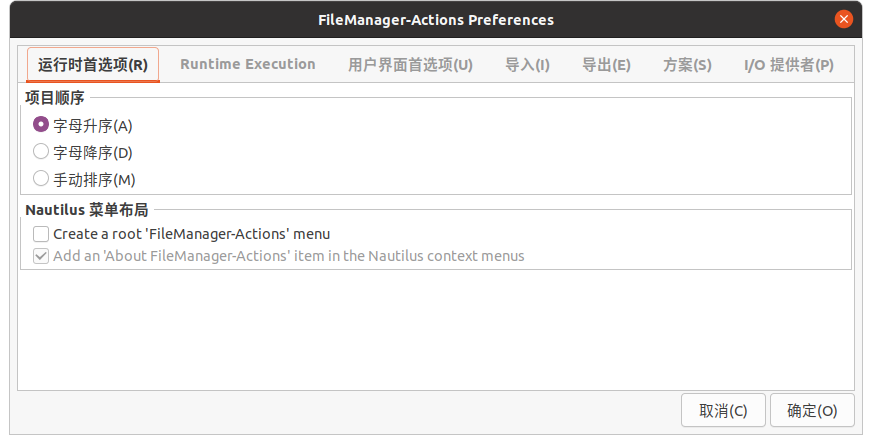
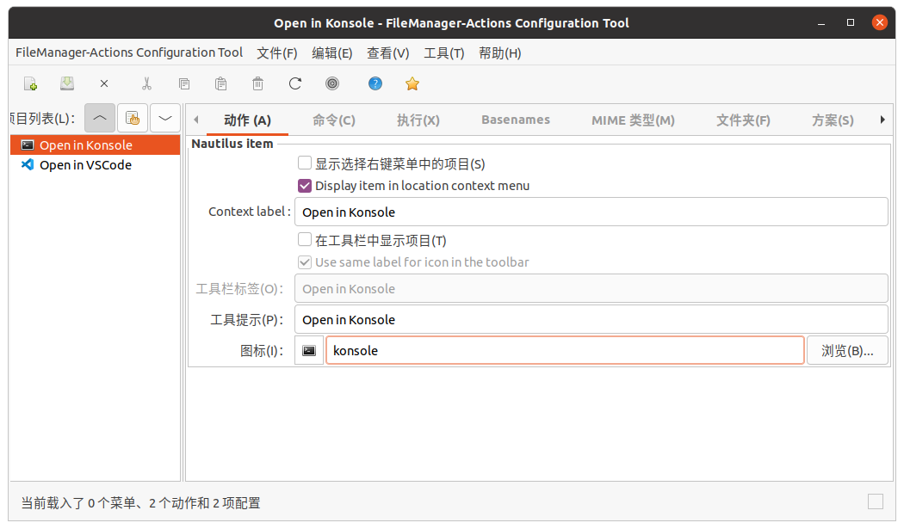
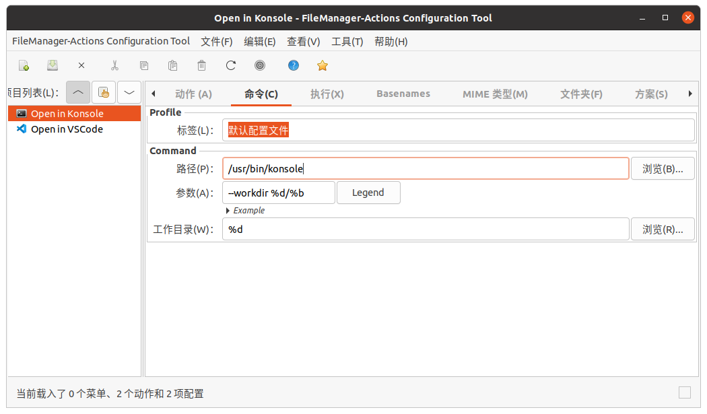
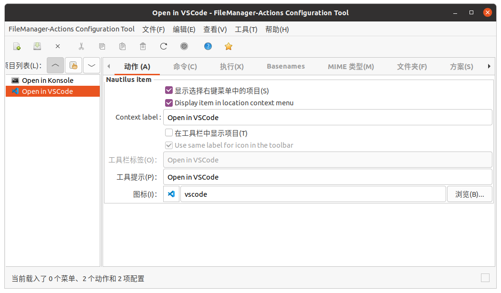
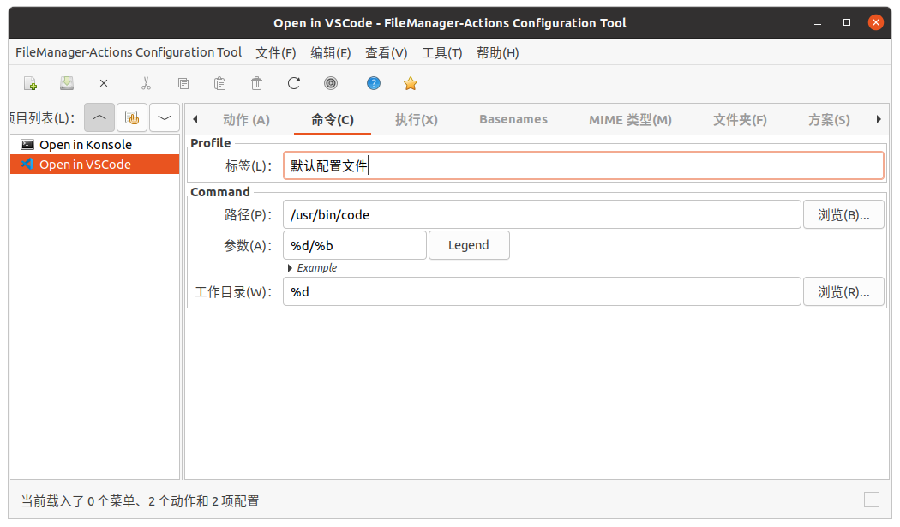

## 修改 EFI 引导位置（可选）

> **适用场景**：Windows 和 Ubuntu 双系统时，Ubuntu 的 EFI 引导被安装到了 Windows 磁盘上。这会导致 Ubuntu 依赖 Windows 硬盘才能启动。  
> 难绷的是，由于某些版本 Ubuntu 安装程序的 bug，在安装时无论怎么选，Ubuntu 的 EFI 引导都会被安装到 Windows 磁盘上。

1. **检查 EFI 分区**  
   确认 Ubuntu 磁盘上是否存在 EFI 分区，如果没有就创建一个

2. **查找 EFI 分区**  
   ```bash
   lsblk
   ```
   找到 Ubuntu 硬盘上的 EFI 分区（如 `nvme1n1p5`）

3. **获取 UUID**  
   ```bash
   sudo blkid /dev/分区名
   ```
   记录输出中的 UUID（如 `5C51-1F97`）

4. **修改 /etc/fstab**  
   将 `UUID=XXXX-XXXX /boot/efi vfat umask=0077 0 1` 中的 `XXXX-XXXX` 替换为上一步获取的 UUID

5. **清理旧引导**  
   ```bash
   sudo rm -rf /boot/efi/EFI/ubuntu
   ```

6. **重新挂载**  
   ```bash
   sudo umount /boot/efi
   sudo mount /dev/新分区 /boot/efi
   ```

7. **更新引导**  
   ```bash
   sudo grub-install
   sudo update-grub
   ```

## 换源

见 [网络/换源](/docs/网络/换源)

## DNS

> <https://dns.icoa.cn>

| DNS 服务器 | 地址                      |
| ---------- | ------------------------- |
| 国内推荐   | `119.29.29.29, 1.2.4.8`   |
| 国内 IPv6  | `2402:4e00::, 240c::6666` |

## （可选）配置 zram

zram 可以压缩内存中不活跃的数据，提供更大的可用内存空间。Ubuntu 主要有两种实现方式：
- **zram-tools**（配置起来更简单）
- **systemd-zram-generator**（更灵活，适合高级用户）

下面仅介绍 zram-tools 的配置方法：

1. **安装 zram-tools**
   ```bash
   sudo apt install zram-tools
   ```

2. **编辑配置文件 `/etc/default/zramswap`**
   ```bash
   sudo nano /etc/default/zramswap
   ```
   常用参数示例：

   ```ini
   # 压缩算法（推荐 lz4 速度快，zstd 压缩率高）
   ALGO=lz4

   # 使用内存百分比（默认 50%）
   PERCENT=50

   # 或者固定大小（MB），与 PERCENT 二选一
   # SIZE=4096

   # 优先级（越高越优先使用 zram）
   PRIORITY=100
   ```

3. **启动/重启服务**
   ```bash
   sudo systemctl daemon-reload
   sudo systemctl restart zramswap
   sudo systemctl enable zramswap
   ```

**验证 zram 状态：**

   ```bash
   # 查看 swap 状态
   swapon --show

   # 查看 zram 详细信息
   zramctl
   ```

## GRUB 超时设置

```bash
sudo nano /etc/default/grub
```

修改 `GRUB_TIMEOUT` 值（如改为 `5`），若无效则添加：

```bash
GRUB_RECORDFAIL_TIMEOUT=3
```

应用更改：
```bash
sudo update-grub
```

## 关机超时设置

```bash
sudo nano /etc/systemd/system.conf
```

取消注释并修改：

```ini
DefaultTimeoutStartSec=30s
DefaultTimeoutStopSec=30s
```

应用更改：
```bash
systemctl daemon-reload
```

## Keychron 键盘 F1-F12 映射修复

> Ubuntu 22.04 及以上版本无需此操作。

```bash
# 临时生效（重启后失效）
echo 0 | sudo tee /sys/module/hid_apple/parameters/fnmode

# 永久生效
echo "options hid_apple fnmode=0" | sudo tee -a /etc/modprobe.d/hid_apple.conf
sudo update-initramfs -u
```

## 禁用鼠标键盘唤醒

[转到配置文件和脚本](https://github.com/MirTITH/MirTITH.github.io/tree/main/content/docs/Linux/ubuntu-安装指南/config_files)

### 对于 G304 鼠标

```bash
export MOUSE="G304"
sudo cp config_files/config-${MOUSE}-wakeup.sh /lib/systemd/system-sleep/
sudo chmod +x /lib/systemd/system-sleep/config-${MOUSE}-wakeup.sh
sudo cp config_files/disable-${MOUSE}-wakeup.service /etc/systemd/system/
sudo systemctl daemon-reload
sudo systemctl enable disable-${MOUSE}-wakeup.service
```

### 对于 G102 鼠标

将上面的 `G304` 替换为 `G102` 即可。

### 其他鼠标

1. **查找设备 ID**

```bash
lsusb
# 示例：Bus 005 Device 003: ID 046d:c53f Logitech, Inc. USB Receiver
# 格式：idVendor:idProduct
```

1. **修改`config-G304-wakeup.sh`脚本**  
   替换其中的 `idVendor` 和 `idProduct`，另存为新文件

2. **修改`disable-G304-wakeup.service`**  
   把其中的 G304 替换为新名字

3. **部署脚本**  
   ```bash
   sudo cp config-新名字-wakeup.sh /lib/systemd/system-sleep/
   sudo chmod +x /lib/systemd/system-sleep/config-新名字-wakeup.sh
   sudo cp disable-新名字-wakeup.service /etc/systemd/system/
   sudo systemctl daemon-reload
   sudo systemctl enable disable-新名字-wakeup.service
   ```

## reboot-to-ubuntu.sh

```bash
#!/bin/bash
set -e

search_result=$(efibootmgr | grep ubuntu)
boot_id=${search_result:4:4}
echo $search_result

sudo efibootmgr --bootnext $boot_id
sudo reboot
```

> 参考自：<https://askubuntu.com/a/713247>

## 开机挂载硬盘

- **方法1**：仿照如下修改 `/etc/fstab`
- **方法2**：使用图形工具配置  
  - GNOME: `sudo apt install gnome-disk-utility`
  - KDE: 使用 KDE 分区管理器（KDE 22.04 及以上版本）

```bash
# /etc/fstab 示例
# <file system>                             <mount point>        <type> <options>     <dump>  <pass>
UUID=bc37ee02-3ac4-44da-b6ad-34f43a80673b   /                    ext4   errors=remount-ro       0 1 
UUID=5C51-1F97                              /boot/efi            vfat   umask=0077              0 1 
UUID=4b888711-6ff2-480f-9615-700ec0e7a8c4   none                 swap   sw                      0 0 
UUID=f4bc711c-5c5e-40e0-92e5-38a351d20f43   /mnt/ubuntu          ext4   defaults                0 0 
UUID=7080BF8880BF5378                       /mnt/win_e           ntfs   defaults,windows_names  0 0 
UUID=7C506F8E506F4DC8                       /mnt/win_d           ntfs   defaults,windows_names  0 0 
/mnt/ubuntu/home/xy/Documents               /home/xy/Documents   none   bind                    0 0
/mnt/ubuntu/home/xy/Downloads               /home/xy/Downloads   none   bind                    0 0
/mnt/ubuntu/home/xy/Music                   /home/xy/Music       none   bind                    0 0
/mnt/ubuntu/home/xy/Pictures                /home/xy/Pictures    none   bind                    0 0
/mnt/ubuntu/home/xy/Videos                  /home/xy/Videos      none   bind                    0 0
```

## locate 命令 updatedb 搜索路径配置

> ubuntu 22.04 有效，ubuntu 20.04 无效

/etc/updatedb.conf

```properties
PRUNE_BIND_MOUNTS="no"
# PRUNENAMES=".git .bzr .hg .svn"
PRUNEPATHS="/tmp /var/spool /media /mnt /var/lib/os-prober /var/lib/ceph /home/.ecryptfs /var/lib/schroot"
PRUNEFS="NFS afs autofs binfmt_misc ceph cgroup cgroup2 cifs coda configfs curlftpfs debugfs devfs devpts devtmpfs ecryptfs ftpfs fuse.ceph fuse.cryfs fuse.encfs fuse.glusterfs fuse.gvfsd-fuse fuse.mfs fuse.rclone fuse.rozofs fuse.sshfs fusectl fusesmb hugetlbfs iso9660 lustre lustre_lite mfs mqueue ncpfs nfs nfs4 ocfs ocfs2 proc pstore rpc_pipefs securityfs shfs smbfs sysfs tmpfs tracefs udev udf usbfs"
```

## Kubuntu 休眠按钮

> kubuntu 22.04 测试成功

1. 启用休眠功能：

   1. 创建SWAP分区，启动SWAP

   2. 找到 SWAP 分区的 UUID：

      ```bash
      sudo blkid | grep swap
      ```

  3. 编辑 `/etc/default/grub`，向 `GRUB_CMDLINE_LINUX_DEFAULT` 添加 `resume=xxx`，例如：

      ```
      GRUB_CMDLINE_LINUX_DEFAULT="quiet splash resume=UUID=xxxx-xxxx-xxxx"
      ```

   4. `sudo update-grub`

   5. 重启

   6. 测试是否能够休眠：

      ```bash
      sudo systemctl hibernate
      ```

2. 添加休眠按钮

```bash
sudo -i
cd /var/lib/polkit-1/localauthority/50-local.d/
cat > com.ubuntu.enable-hibernate.pkla << 'EOF'
[Re-enable hibernate by default in upower]
Identity=unix-user:*
Action=org.freedesktop.upower.hibernate
ResultActive=yes

[Re-enable hibernate by default in logind]
Identity=unix-user:*
Action=org.freedesktop.login1.hibernate
ResultActive=yes
EOF
```

## v2rayA

- 官网：<https://v2raya.org>
- 安装方法：<https://v2raya.org/docs/prologue/installation/debian/>
- 安装完成后访问：<http://localhost:2017>

### （可选，建议）让 `sudo` 继承代理变量

> 这样在执行 `sudo pacman -Syu`、`sudo apt update` 等命令时也会遵守代理环境变量中的设置。

```bash
paru -S --needed vi
sudo visudo
```

添加（优先尝试这一行）：

```text
Defaults env_keep += "*_proxy *_PROXY"
```

若系统提示语法不支持，则改用：

```text
Defaults env_keep += "http_proxy https_proxy ftp_proxy all_proxy no_proxy HTTP_PROXY HTTPS_PROXY FTP_PROXY ALL_PROXY NO_PROXY"
```

## 字体安装

- **KDE**：文件管理器右键安装
- **GNOME**：手动安装

```bash
# 手动安装字体
sudo cp <字体文件>.ttf /usr/share/fonts/truetype/<新文件夹>/
sudo fc-cache -fv

# 查看已安装字体
fc-list
```

## Git 配置

```bash
git config --global user.name "<your-name>"
git config --global user.email "<your-email>"
git config --global core.quotepath false
```

## Zsh

```bash
# 安装 Zsh
sudo apt install zsh
chsh -s $(which zsh)  # 设置为默认 shell

# 临时切换回 bash
exec bash
```

### Oh My Zsh

```bash
sh -c "$(curl -fsSL https://raw.github.com/ohmyzsh/ohmyzsh/master/tools/install.sh)"
```

### 主题：powerlevel10k

```bash
git clone --depth=1 https://github.com/romkatv/powerlevel10k.git ${ZSH_CUSTOM:-$HOME/.oh-my-zsh/custom}/themes/powerlevel10k
# 在 ~/.zshrc 中设置 ZSH_THEME="powerlevel10k/powerlevel10k"
```

### 插件

```bash
git clone https://github.com/zsh-users/zsh-autosuggestions ${ZSH_CUSTOM:-~/.oh-my-zsh/custom}/plugins/zsh-autosuggestions
git clone https://github.com/zsh-users/zsh-syntax-highlighting.git ${ZSH_CUSTOM:-~/.oh-my-zsh/custom}/plugins/zsh-syntax-highlighting
git clone https://github.com/conda-incubator/conda-zsh-completion ${ZSH_CUSTOM:=~/.oh-my-zsh/custom}/plugins/conda-zsh-completion
```

然后编辑 `~/.zshrc`:

```bash
plugins=(
    git
    z
    zsh-autosuggestions
    zsh-syntax-highlighting
    conda-zsh-completion
)
```

## 输入法

### kununtu 22.04：建议 fcitx5

直接安装 [language package](#language-package)，这会帮你安装 fcitx5

之后重启系统，在系统设置的输入法界面添加 Pinyin 输入法（不是 Keyboard - Chinese）

### kubuntu 20.04：建议搜狗输入法

<https://pinyin.sogou.com/linux/?r=pinyin>

搜狗输入法不显示问题：安装以下依赖

```bash
sudo apt install libqt5qml5 libqt5quick5 libqt5quickwidgets5 qml-module-qtquick2
sudo apt install libgsettings-qt1
```

解决 konsole，kate等软件无法切换中文输入法：

修改/etc/profile，增加以下语句：

```bash
#fcitx
export XIM_PROGRAM=fcitx
export XIM=fcitx
export GTK_IM_MODULE=fcitx
export QT_IM_MODULE=fcitx
export XMODIFIERS="@im=fcitx"
```

注销或重启即可解决问题

### ubuntu 20.04：建议系统自带的

## language package

```bash
sudo apt install $(check-language-support)

# 安装中文语言包、GNOME 包和 KDE 包
sudo apt install "language-pack-zh-han*" "language-pack-gnome-zh-han*" "language-pack-kde-zh-han*"
```

注意⚠️如果使用搜狗输入法，需卸载 `fcitx-ui-qimpanel`（不使用则无需操作）：

```bash
sudo apt purge fcitx-ui-qimpanel
```

# 一些软件

## Edge

官网下载安装包

如果想配置必应国际版搜索引擎：

```
{bing:baseURL}search?q=%s&{bing:cvid}{bing:msb}{google:assistedQueryStats}
```

**如果遇到`GPG error "NO_PUBKEY"`：**

在终端执行以下命令：

```shell
sudo apt-key adv --keyserver keyserver.ubuntu.com --recv-keys <PUBKEY>
```

其中 `<PUBKEY>` 是缺失的仓库公钥，例如 `8BAF9A6F`。

然后更新：

```shell
sudo apt-get update
```

**如果遇到 Warning: apt-key is deprecated:** 

<https://askubuntu.com/questions/1398344/apt-key-deprecation-warning-when-updating-system>

## Samba

[samba使用教程.md](../samba/samba使用教程.md)

## 其他软件

```bash
sudo apt install gnome-disk-utility
sudo apt install gnome-keyring
sudo apt install yakuake
pip3 install tldr
sudo apt install flameshot # https://github.com/flameshot-org/flameshot
```

## 视频解码器

> 仅在需要时安装

```bash
sudo apt install libdvdnav4 gstreamer1.0-plugins-bad gstreamer1.0-plugins-ugly libdvd-pkg -y
sudo dpkg-reconfigure libdvd-pkg
sudo apt install ubuntu-restricted-extras
```

> 参考自：<https://linuxhint.com/install-h264-decoder-ubuntu/>

## Gnome桌面环境推荐额外安装：

### konsole 终端

```
sudo apt install konsole
# 切换默认终端
sudo update-alternatives --config x-terminal-emulator
```

### Gnome 插件

```
sudo apt install gnome-tweak-tool gnome-shell-extensions gnome-shell-extension-prefs gnome-shell-extension-autohidetopbar gnome-shell-extension-dash-to-panel
```

### 剪切板

```
sudo apt install parcellite
```

然后按 `Ctrl`+`Alt`+P 打开设置菜单

### 文件管理器右键菜单

```
sudo apt install nautilus-actions filemanager-actions
```

然后打开 fma-config-tool

(配置完可能需要重启 nautilus 才能生效：`nautilus -q`)

Preference:



**Open in Konsole**





**Open in VSCode**






# 常见问题

## KDE Dolphin 无法访问 Windows 共享文件夹

**问题**：报错 `The file or folder smb://ip does not exist.`

**解决方法**：在系统设置 -> 网络设置 -> Windows 共享中，填入任意用户名和密码，然后重启 Dolphin。

> 参考：<https://forum.manjaro.org/t/dolphin-the-file-or-folder-smb-sharename-does-not-exist/114900/10>

## update-grub 不会找到其他 btrfs 分区中的 Linux

> GRUB 的 os-prober 在检测 btrfs 子卷时存在问题。解决方案：在每个 btrfs 卷根目录创建 `@/boot` 和 `@/etc` 的符号链接。

```bash
#navigate to root of your current booted brtfs based OS
cd /
#create symlink for boot
ln -s @/boot boot
#create symlink for etc
ln -s @/etc etc

#mount the other btrfs volume with OS-install and navigate to its root
cd /mnt/exampleotherbtrfsvolume
#create symlink for boot
ln -s @/boot boot
#create symlink for etc
ln -s @/etc etc

#let grub detect btrfs based install volume
sudo update-grub2

#reboot to the other btrfs based OS (probably listed this time in grubmenu)
#let this grub detect the previously booted btrfs volume
sudo update-grub2
```

> 参考自：<https://askubuntu.com/a/1032354>
