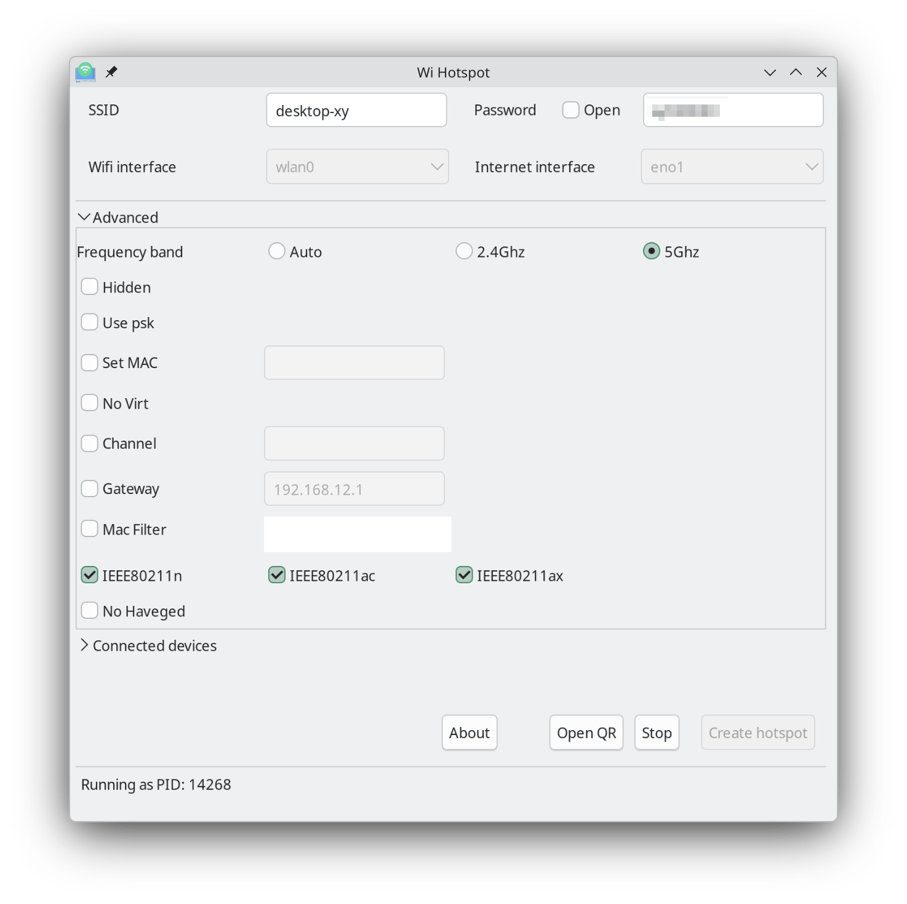

## KDE 开启的热点无网络

先关闭防火墙（如果有），仍然不行。经排查，是由于安装了 docker 导致的。执行下面的命令会发现，Chain FORWARD 的默认策略是 DROP：

```bash
sudo iptables -L FORWARD -n -v
```

输出如下：
```
Chain FORWARD (policy DROP 0 packets, 0 bytes)
 pkts bytes target     prot opt in     out     source               destination         
    0     0 DOCKER-USER  all  --  *      *       0.0.0.0/0            0.0.0.0/0           
    0     0 DOCKER-FORWARD  all  --  *      *       0.0.0.0/0            0.0.0.0/0
```

虽然后面经过折腾解决了，但感觉比较麻烦，而且 KDE 的热点速度也不快（比如不能选择使用 WiFi6），所以就放弃了 KDE 的热点，改为使用 Wifi Hotspot 这个工具来创建热点，速度快了很多，也不会和 docker 冲突了。



勾选上 `IEEE80211n`, `IEEE80211ac` 和 `IEEE80211ax`，就可以创建 WiFi6 热点了。有些网卡不支持 5Ghz，可以换成 2.4Ghz 的频段。

Arch Linux 上安装 Wifi Hotspot (archlinuxcn, AUR)：

```bash
paru -S linux-wifi-hotspot
```

## R7000p 混合显卡模式无法调整亮度

在 `/etc/default/grub` 的 `GRUB_CMDLINE_LINUX_DEFAULT` 行添加：
```conf
amdgpu.backlight=0
```
完整示例：
```conf
# GRUB_CMDLINE_LINUX_DEFAULT='nowatchdog nvme_load=YES zswap.enabled=0 loglevel=3 amdgpu.backlight=0'
```

然后更新 grub：
```bash
sudo grub-mkconfig -o /boot/grub/grub.cfg
```