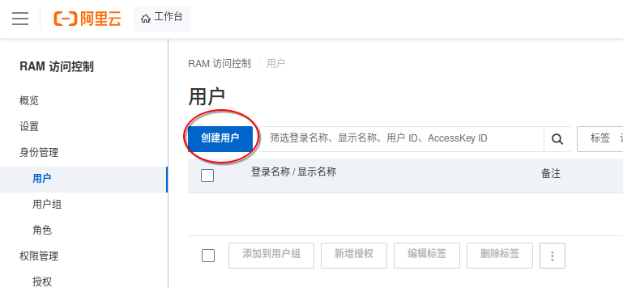
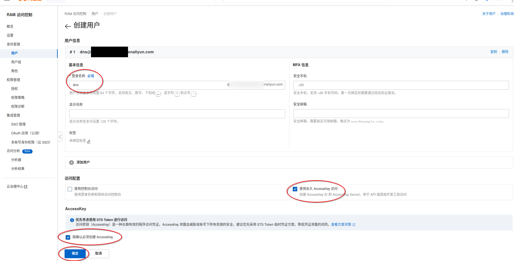
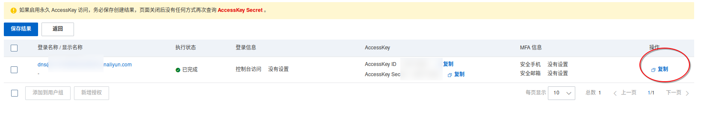
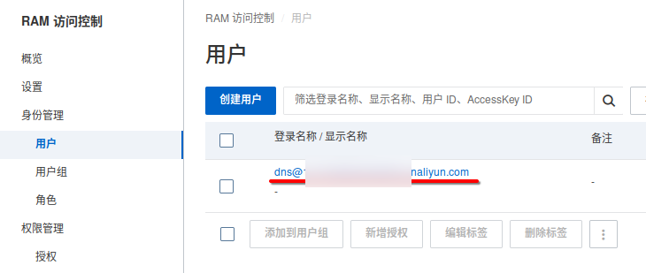
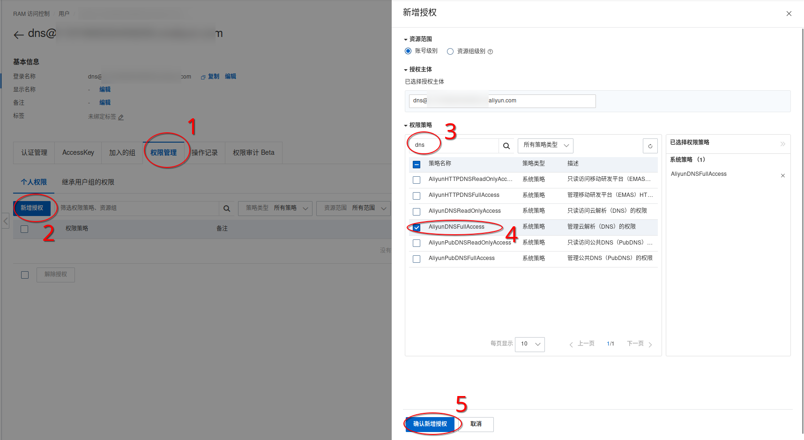

## 什么是 DDNS

DDNS（动态域名系统）是一种允许用户将动态 IP 地址映射到固定域名的服务。它使得用户可以通过一个易记的域名访问其设备或服务，即使其 IP 地址经常变化。

## 基于阿里云 AccessKey 的 DDNS

在阿里云购买域名后，可以使用其提供的 API 来配置解析记录。使用阿里云的 API 需要 AccessKey，而直接使用主账号的 AccessKey 存在安全风险。建议创建一个 RAM 用户，并为其分配最小权限的策略，以确保安全性。

为了实现基于阿里云 AccessKey 的 DDNS，我们不需要手动编写脚本，可以使用现有的 DDNS 客户端工具，例如 [DDNS](https://github.com/NewFuture/DDNS) 或 [ddns-go](https://github.com/jeessy2/ddns-go)。

以下是实现步骤。

### 1 创建 RAM 用户

访问 https://ram.console.aliyun.com/users

点击`创建用户`：


输入登录名称（例如 dns），勾选 `使用永久 AccessKey 访问`、`我确认必须创建 AccessKey`，点击确定：



点击右边的`复制`，复制 AccessKey（也可以点击`保存结果`，将AccessKey保存成csv文件），完成后点击`返回`：



点击 `dns@xxxxx.onaliyun.com`：



依次点击`权限管理`、`新增授权`，在右侧搜索 `dns`，勾选 `AliyunDNSFullAccess`，点击`确认新增授权`：



### 2 配置 DDNS（动态域名系统）

可选择使用 [DDNS](https://github.com/NewFuture/DDNS) 或 [ddns-go](https://github.com/jeessy2/ddns-go)。

DDNS 是一个轻量级的脚本，ddns-go 则拥有 Web 界面，二者任选其一，推荐 DDNS。

### 2.1 使用 DDNS

**下载 DDNS：**

按照官网说明，前往[release下载对应版本](https://github.com/NewFuture/DDNS/releases/latest)

**下载完成后，安装到系统目录：**

```bash
sudo install -m 0755 ddns-glibc-linux_amd64 /usr/local/bin/ddns
```

**创建配置文件：**

```bash
sudo mkdir /etc/ddns
sudo nano /etc/ddns/config.json
```

将以下内容复制进去，替换其中的 AccessKey 和域名：

```json
{
  "$schema": "https://ddns.newfuture.cc/schema/v4.1.json", // 格式验证
  "dns": "alidns", // 当前服务商
  "id": "your_access_key_id", // AccessKey ID
  "token": "your_access_key_secret", // AccessKey Secret
  "ipv4": [
    "hostname.example.com",
    "*.hostname.example.com"
  ], // IPv4 域名
  "index4": [
    "default"
  ], // IPv4地址来源
  "ipv6": [
    "hostname.ipv6.example.com"
  ], // IPv6 域名
  "index6": [
    "default"
  ], // IPv6地址来源
  "ttl": 600 // DNS记录TTL（秒）
}
```

> [!NOTE] 详细用法请参考 [DDNS JSON配置说明](https://github.com/NewFuture/DDNS/blob/master/docs/config/json.md)

**设置配置文件权限，确保只有 root 用户可以读取：**

```bash
sudo chmod 600 /etc/ddns/config.json
```

**启动 DDNS：**

```bash
sudo ddns -c /etc/ddns/config.json
```

**配置定时任务：**

```bash
# 安装并指定更新间隔（分钟）
sudo ddns task --install 5 -c /etc/ddns/config.json
```

### 2.2 使用 ddns-go

> [!IMPORTANT]
> 截至 2026-02-08，ddns-go 的 Arch Linux 包会在 `/etc/ddns-go` 目录下明文保存 AccessKey，且任何用户均可读取，存在安全风险。建议手动安装 ddns-go 并将配置文件权限设置为仅 root 可读，或者使用 DDNS 脚本。

下载并安装 [ddns-go](https://github.com/jeessy2/ddns-go)

对于 Arch Linux 用户，可以使用来自 archlinuxcn 或 AUR 的包：

```bash
paru -S ddns-go
```

启动 ddns-go：

```bash
sudo systemctl enable --now ddns-go.service 
```

打开浏览器并访问 <http://localhost:9876> 进行初始化配置

> [!NOTE]
> 可以额外参考 [免费SSL证书](../免费ssl证书/) 为 ddns-go 配置 HTTPS 访问。
